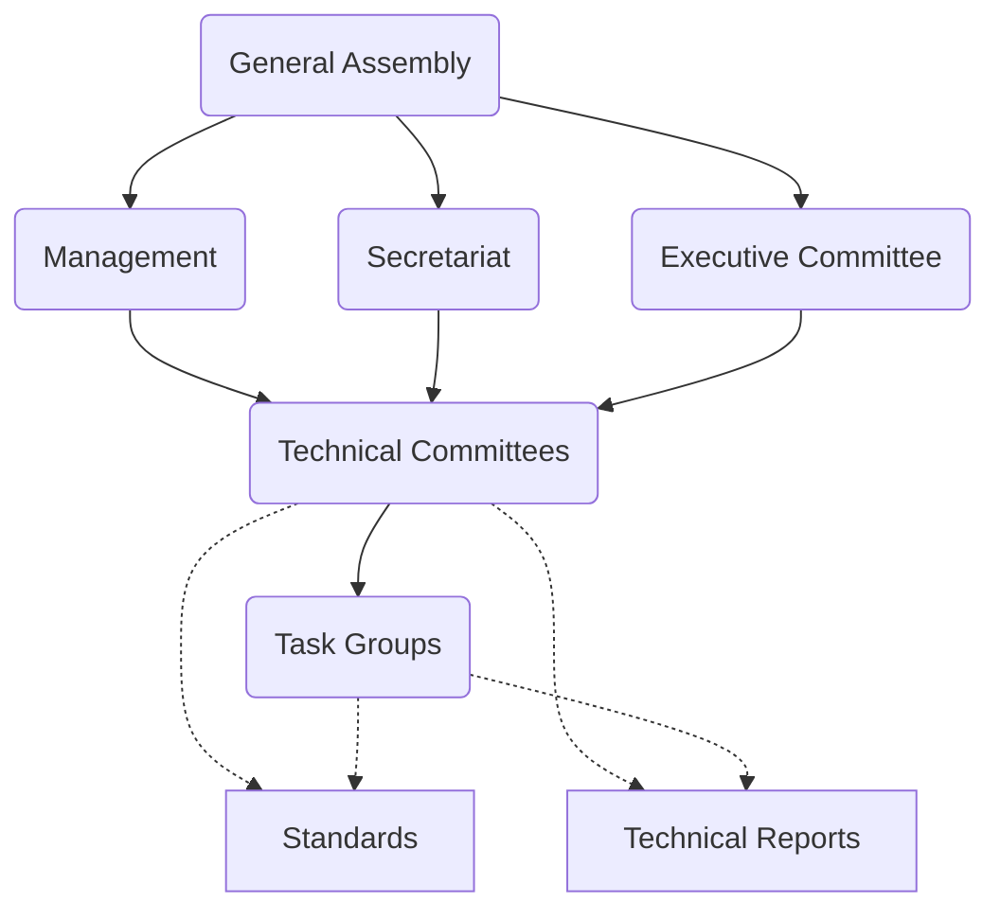

Twice a year, I come back from an [Ecma International][ecma] ExecCom meeting on behalf of [TC39][tc39]. It's the biannual gathering of [Ecma's executive committee][execom], where a good chunk of the organization's real administrative work actually happens, and where officers of the various [TCs (Technical Committees)][ecma-tcs] come together to present status reports, catch up on what's going on across the org, and respond to whatever initiatives are currently in motion.

To some readers, that opening sentence is already an exciting glimpse into something they'd been curious about. For everyone else, it's a pile of jargon. Fair enough.

Despite several of us dedicating large parts of our lives to this standards organization — the one that governs the development of what happens to be one of the most widely used programming languages on the planet, powering the web and basically anything with a UI — there's a wide gap between how the people inside the system perceive their work and how everyone else experiences it. Most JavaScript developers I talk to have no clear sense of what Ecma is, who runs it, or how any of it relates to the language they use every day.

~~Over the years, I and many others have given talks, written posts, and sat on podcasts trying to explain what TC39 is and how the work gets done. Despite that, the tight time budgets and the genuinely detailed nature of the material mean we’ve mostly failed to make this common knowledge.~~

And why *should* they have that sense? Because the more visible the governance of JavaScript is to the people using it, the more accountable we become, and the more responsible we have to be. That matters more now than it used to. In an AI-assisted development world, the average JavaScript developer is spending less time writing code and more time explaining what they want to a coding agent. The language decisions we make flow downstream through the models and into the prompts people write. ~~We should take that seriously.~~

So: a field guide to Ecma, in more detail than I've put in one place before. This is Part 1, covering the organization itself. Part 2 will dig into three of the committees in detail: [TC39 (ECMAScript)][ecma-tc39], [TC53 (ECMAScript modules for embedded systems)][ecma-tc53] and [TC55 (Web-interoperable server runtimes)][ecma-tc55], where the actual JavaScript language lives.

~~(IMO you should consider listing TC53 here, it's definitely an ECMAScript TC -- Aki)~~

## Ecma International

ECMA used to be an acronym (for "European Computer Manufacturers' Association"). It isn't anymore — it's a proper noun now (like [npm](https://github.com/orgs/community/discussions/160359#discussioncomment-13353035)). Ecma International is a standards development organization based in Geneva, Switzerland, similar to other standards bodies like [ISO][iso], [W3C][w3c], and the [Unicode Consortium][unicode]. Historically it has maintained [a broad portfolio of technology standards][ecma-standards] (including [the CD-ROM format][ecma119] for instance), but today it's best known as the home of the ECMAScript language specification. That is to say, JavaScript.

## Members are organizations, not people

Here's the first thing that trips people up: the members of ECMA are companies and organizations, not individuals. You and I, as individuals, can participate as delegates or invited experts, but we don't hold membership. Generally, it's either your direct employer, the non-profit/open-source project you volunteer for or academic institution you're a part of that does.

ECMA has five categories of members, who each pay a flat annual membership fee that hasn't changed for over 25 years.

**Ordinary members** (70k CHF) — despite the name, this is the top tier. Ordinary members hold exclusive voting rights in the General Assembly and on ECMA's administrative matters. Worth flagging: those voting rights do *not* extend to technical matters. Inside the TCs, every member is equal, regardless of the tier their organization sits in. The current ordinary members are Apple, Bloomberg, Google, Huawei, IBM, and Meta.

(Maybe worth mentioning that ordinary members can set the direction of Ecma's work, including whther or not to start new TCs or publish standards -- Aki)

**Associate members** (35k CHF) are large organizations that, for whatever reason, aren't paying the premium for ordinary status. That's a perfectly reasonable choice, because ordinary membership doesn't buy any technical edge. The list here is long and includes Alibaba, Cloudflare, Dell, F5 Networks, JetBrains, Microsoft, Oracle, ServiceNow, Shopify, and Sony Interactive Entertainment, among others.

**SME members** (17.5k CHF) are small and medium-sized enterprises. The line is drawn by size, specifically organizations with an annual global turnover under 100 million Swiss francs. At the time of writing there are exactly four: Head Acoustics, HeroDevs, Igalia (that's us), and Vercel.

**SPC members** (3.5k CHF) are smaller still. No more than 25 employees and a turnover under 10 million Swiss francs. Size notwithstanding, plenty of interesting work comes out of this tier. The current list includes Agoric, Deno, Moddable, Orama, Socket Security, Surge, SujiTech, and Zalari.

**NFP members** (0 CHF) are non-profits, which covers academic institutions and open-source foundations. The list is eclectic: Major universities and academic institutions from across the world like ETH Zürich, Indiana University, the IITs in India (though I've yet to see them actively participate — I wish they did more), KAIST (whose work with us on the ESMeta project has been excellent), the University of Bergen (whose recent contributions have been massive and who are in some ways our liasons to the academic world at large), the OpenJS Foundation, the Apache Software Foundation, the Library of Congress, OWASP, the Open Source Business Alliance, and — most visibly for many readers — the Mozilla Foundation.

Between them, these members send delegates to the various technical committees, and ECMA's own staff supports that work from the secretariat. Most of the people you meet around ECMA are technical contributors employed by one of these member organizations.

## How Ecma is governed

Ecma's structure has a clear hierarchy, so let me walk it from the top.

### The General Assembly

The General Assembly, or GA, is the highest authority in ECMA. Every member sends one representative. In practice, the GA is mostly a formal body — it ratifies final standards and votes on the big-picture questions — and it delegates day-to-day work downward.

### Management

ECMA's management is three elected officers, chosen from within the GA:

- **President**: Theresa O’Connor (Apple)
- **Vice President**: Jochen Friedrich (IBM)
- **Treasurer**: Chris Wilson (Google)

<ADD NOTE ABOUT CHRIS' RETIREMENT>

[!!] One small but telling update here: Chris has recently been succeeded in his GA role by Olivier Flückiger, who many in TC39 will already recognize. Olivier being the Google GA representative says a lot about how important TC39 is to Google.

### The Secretariat

If the management is the elected leadership, the secretariat is the staff — the people who actually work at ECMA and keep the organization running day to day.

- **Secretary General**: Samina Hussain
- **Senior Manager**: Aki Rose Braun
- **Chief Technical Officer**: Patrick Luthi
- **Office Manager**: Isabelle Walsh
- **Secretariat and Webmaster**: Patrick Charollais

I want to single Aki out. She is genuinely one of the most helpful people in the whole organization, and a lot of what makes the communication between the committees and ECMA leadership actually work is her doing. She translates between highly technical, motivated TC members and the more bureaucratic parts of the organization, and she's extremely good at it.

Samina, as Secretary General, keeps the lights on and keeps us all pointed at a unified goal. As TC chairs, those of us who serve in that role try to support that direction by constantly steering our committees toward productivity and consensus rather than friction.

### The Executive Committee

The ExeCom is the body that I mentioned in the beginning that meets twice every year. It's an elected group that makes recommendations to the GA on business, legal, managerial, and organizational matters, including specific things like organizing, adding, and dissolving technical committees. It runs the organization between GA meetings.

Its current composition is:

- **Chair**: Jochen Friedrich (elected from within the group)
- **From ordinary members**: Ayla Chang (Huawei), Andrew Paprocki (Bloomberg)
- **From non-ordinary members**: Mikhail Barash (University of Bergen), Patrick Dwyer (OWASP), Peter Hoddie (Moddable), Ross Kirsling (Sony Interactive Entertainment)

Several of the non-ordinary-member ExecCom seats are held by people active in TC39 — Ross, Peter, and Mikhail among them. That's not an accident. It's useful for us to have people in the ExecCom who know the TC side intimately and can translate in both directions.

### Technical committees and task groups

This is where the actual technical work happens: the ECMAScript specification, the Internationalization API, the recently-chartered TC55 on web interoperability. That's all for Part 2.

## Related organizations

Ecma has cooperation agreements and liaisons with a handful of related bodies. The list is short enough to name in full:

- **EC MSP** — European Multi-Stakeholder Platform on ICT Standardisation
- **IEC** — International Electrotechnical Commission
- **IETF** — Internet Engineering Task Force (I've been participating here as well)
- **ISO** — International Organization for Standardization, the one you've probably heard of
- **ITU** — International Telecommunication Union
- **JTC 1** — ISO/IEC JTC 1 Information Technology, the joint technical committee of ISO and IEC
- **W3C** — the World Wide Web Consortium, which is where virtually every web specification that isn't at WHATWG or at TC39 lives

(Based on some of the TC chair reports on their liaisons, i think this list might actually be much longer -- Aki)

## The shape of the org
FIXME: Rewrite this section

The General Assembly sits on top. It formally controls the secretariat, the ExecCom, and management, all of which shape what the TCs can do. In practice, the GA is mostly a ratifying body. The ExecCom, being smaller and more active, actually runs the organization between GA meetings. And the TCs, where the real technical work lives, operate under that framework.

That last layer is where JavaScript, the language itself, actually gets made. That's where Part 2 picks up: a closer look at the technical committees, especially TC39, TC53 and TC55. Stay tuned.

[ecma]: https://ecma-international.org/
[tc39]: https://tc39.es/
[execom]: https://ecma-international.org/organisation/#executive-committee
[ecma-tcs]: https://ecma-international.org/technical-committees/
[ecma-tc39]: https://ecma-international.org/technical-committees/tc39/
[ecma-tc53]: https://ecma-international.org/technical-committees/tc53/
[ecma-tc55]: https://ecma-international.org/technical-committees/tc55/
[ecma-standards]: https://ecma-international.org/publications-and-standards/standards/
[iso]: https://www.iso.org/
[w3c]: https://www.w3.org/
[unicode]: https://home.unicode.org/
[ecma119]: https://ecma-international.org/publications-and-standards/standards/ecma-119/
