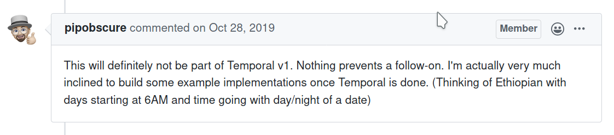
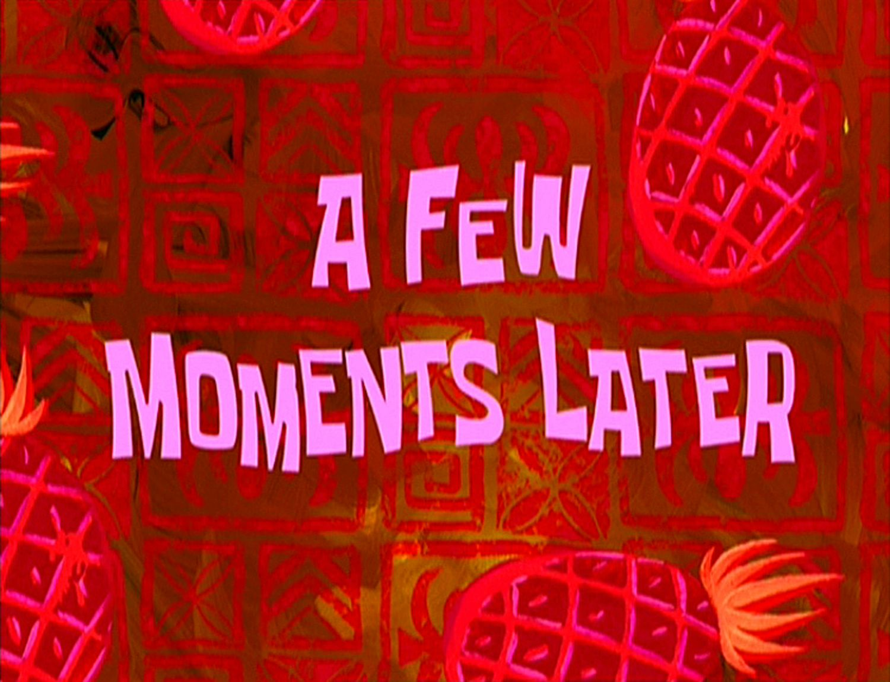
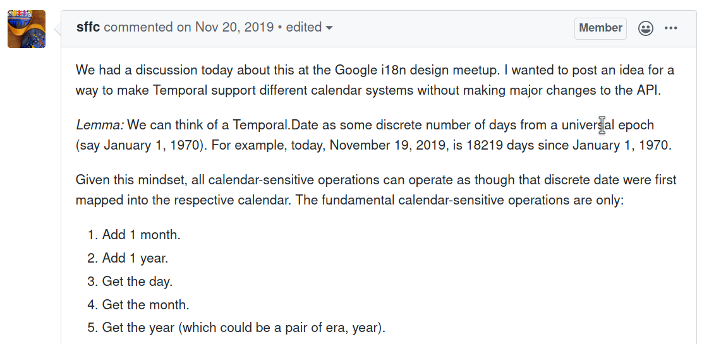
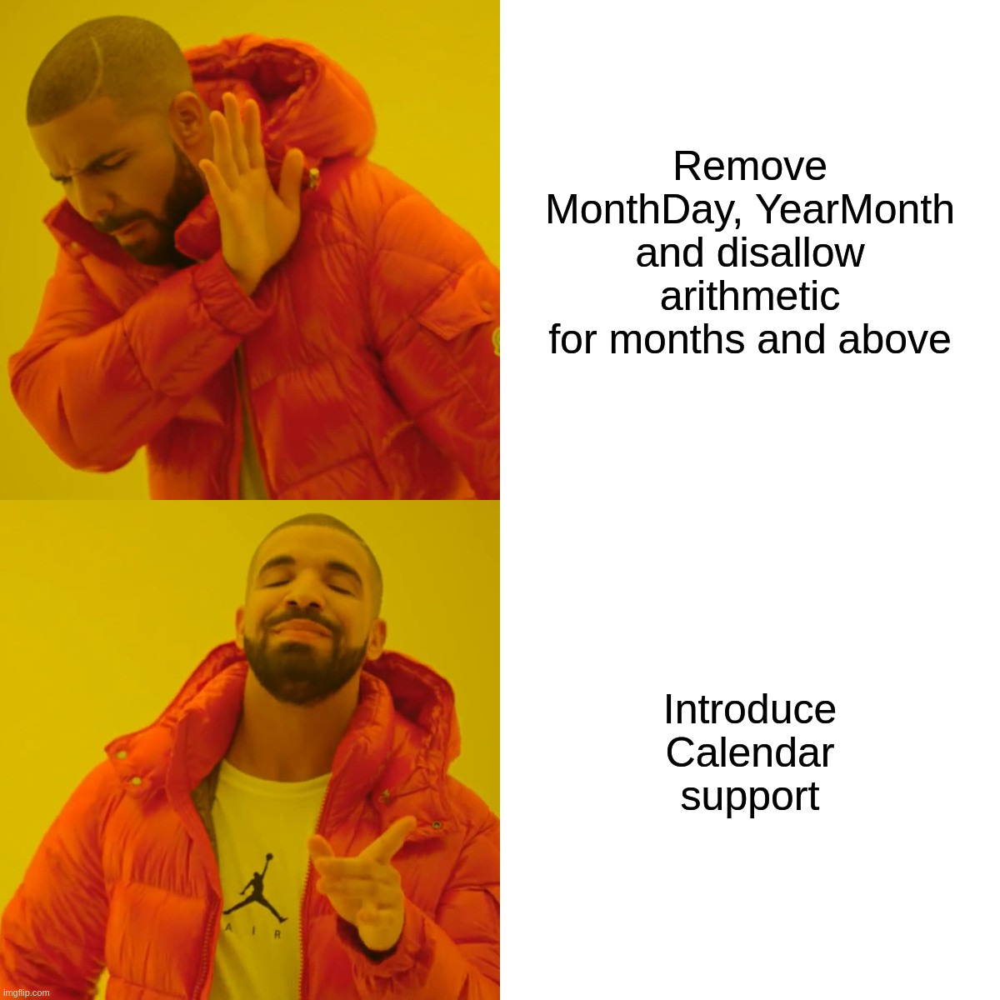

# `Temporal.Calendar`

---

## Welcome to Temporal! Let's start programming.

---

<!-- --- -->

<!-- ```javascript -->
<!-- const absolute = Temporal.now.absolute(); -->

<!-- console.log(absolute.toLocaleString('en-US')); -->
<!-- // '3/31/2020, 5:12:41 PM' -->

<!-- console.log(absolute.toLocaleString('en-US-u-ca-hebrew')); -->
<!-- // '7/6/5780, 5:12:41 PM' -->
<!-- ``` -->

<!-- --- -->

<!-- ## This gets out of hand really fast, however. -->

<!-- --- -->

<!-- ## Our solution? -->

<!-- ## Add necessary information to turn objects into `Absolute`s. -->

<!-- --- -->

<!-- * `DateTime`: Add a `TimeZone`. 😊 -->
<!-- * `Date`: Assume midnight. 😅 -->

<!-- --- -->

<!-- ## Wait, what about Calendars that don't start days at midnight? -->

<!-- --- -->

<!-- ## According to ICU documentation: -->

<!-- > In the traditional Hebrew calendar, days start at sunset. However, in order to keep the time fields in this class synchronized with those of the other calendars and with local clock time, we treat days and months as beginning at midnight, roughly 6 hours after the corresponding sunset. -->

<!-- --- -->

<!-- * `DateTime`: Add a `TimeZone`. 😊 -->
<!-- * `Date`: Assume midnight. 😅 -->
<!-- * `YearMonth` and `MonthDay` 😰 -->

<!-- --- -->

<!-- ## Okay, nerds. Let's talk about math. -->

<!-- --- -->

```javascript
let date = Temporal.now.date();
console.log(d.toLocaleString('en-US-u-ca-hebrew', {day: 'numeric', month: 'long', year: 'numeric'}));
// 'Nisan 6, 5780'

date = date.plus({months: 1})
console.log(d.toLocaleString('en-US-u-ca-hebrew', {day: 'numeric', month: 'long', year: 'numeric'}));
// 'Iyar 6, 5780'

date = date.plus({months: 1})
console.log(d.toLocaleString('en-US-u-ca-hebrew', {day: 'numeric', month: 'long', year: 'numeric'}));
// 'Sivan 7, 5780'

// 'Tamuz 8, 5780'
// 'Av 9, 5780'
// 'Elul 10, 5780'
// 'Tishri 12, 5781'

date = date.plus({years: 1})
console.log(d.toLocaleString('en-US-u-ca-hebrew', {day: 'numeric', month: 'long', year: 'numeric'}));
// 'Tishri 24, 5782'

date = date.plus({years: 1})
console.log(d.toLocaleString('en-US-u-ca-hebrew', {day: 'numeric', month: 'long', year: 'numeric'}));
// 'Tishri 5, 5783'
```

---

* While everyone in 2020 mostly agrees with the concept of a solar day, months and years are concepts that are inherently calendar-dependent.
* Any date-time arithmetic that is rooted in the ISO calendar involving months and years is bound to give unexpected results that will carry over poorly to other calendars.
* TL:DR; any arithmetic with units larger than days cannot be satisfactorily done in a calendar-agnostic way.

---

## We cannot have our cake and eat it too.

---

<!-- ## Table of Contents -->

<!-- * Context 🤓 -->
<!-- * Motivations 🤔 -->
<!-- * Options 😕 -->
<!-- * Explanation 🧠 -->
<!--   * Interface -->
<!--   * Functionality -->
<!--   * API -->
<!--   * Wrapping up loose ends -->
<!-- * Open Questions ❔ -->
<!-- * Default Calendar 😯 -->

<!-- --- -->

<!-- ## Context -->

<!-- * Supported Proleptic Gregorian (ISO8601). -->
<!-- * All other calendars deemed "out of scope". -->
<!-- * Further calendar support to be discussed in follow-up proposals. -->

<!-- --- -->

<!-- ## But why tho? -->

<!-- * `Temporal.Date` has three components: `Year`, `Month` and `Day`. -->
<!-- * Take out any one, and it becomes impossible to perform Calendar conversions. -->
<!-- * Example: Rosh Hashanah, 1 Tishrei in the Hebrew Calendar. -->
<!--   * 2019: 30th September -->
<!--   * 2020: 19th September -->
<!--   * 2021: 7th September -->
<!--   * 2022: 26th September -->
<!-- * Question: Eid al-Fitr, 1 Shawwal in the Islamic Calendar. -->
<!-- * Answer: Don't even ask. -->

<!-- --- -->

<!--  -->

<!-- --- -->

<!--  -->

<!-- --- -->

<!--  -->

<!-- --- -->

<!-- ## But why tho? -->

<!-- * `Date.p.toLocaleString` represents the `Date` in the local calendar. -->
<!-- * It was decided unanimously by the champions group that Temporal's Intl integration would follow those same conventions. -->
<!-- * That comes with its own set of gotchas. -->

<!-- --- -->

<!-- ## But why tho? -->

<!-- ### What Works -->

<!-- * `Date` 👍 -->
<!-- * `Temporal.Absolute` ✅ -->
<!-- * `Temporal.DateTime` ⚠ -->
<!-- * `Temporal.Date` 😅 -->
<!-- * `Temporal.YearMonth`, `Temporal.MonthDay` ❌ -->

<!-- --- -->

<!-- ## But why tho? -->

<!-- * `Temporal.Date` has three components: `Year`, `Month` and `Day`. -->
<!-- * Take out any one, and it becomes impossible to perform Calendar conversions. -->
<!-- * Example: Rosh Hashanah, 1 Tishrei in the Hebrew Calendar. -->
<!--   * 2019: 30th September -->
<!--   * 2020: 19th September -->
<!--   * 2021: 7th September -->
<!--   * 2022: 26th September -->
<!-- * Question: Eid al-Fitr, 1 Shawwal in the Islamic Calendar. -->
<!-- * Answer: Don't even ask. -->

<!-- --- -->

## What are our options?



---

## What even is `Temporal.Calendar`?

* Mechanism to allow arbitrary calendar systems to be implemented on top of Temporal.
* This will be taken care of for *most* users out of the box, and doesn't require any extra know-how.
* Can be used to implement non-built-in calendar systems.
* Plan to expose non-ISO, commonly-used regional calendars via ECMA-402.
* Everything else in userland.

---

## What even is `Temporal.Calendar`?

### How does it look like?

```typescript
class MyCalendar extends Temporal.Calendar {
  id: string;

  // Projection
  toISO(input: Temporal.Date): Temporal.Date;
  fromISO(input: Temporal.Date): Temporal.Date;

  // Construction
  dateFromFields(fields: object): Temporal.Date;

  // Arithmetic
  plus(input: Temporal.Date, duration: Temporal.Duration, options: object): Temporal.Date;
  minus(input: Temporal.Date, duration: Temporal.Duration, options: object): Temporal.Date;
  difference(left: Temporal.Date, right: Temporal.Date, options: object): Temporal.Duration;

  // Accessors
}
```

---

## What even is `Temporal.Calendar`?

### How will it work? (using `Temporal.Date` as an example)

<ul style="font-size: 80%">
<li>Previously, <code>Temporal.Date</code> had three internal slots: year, month and day.
<li>Now, it has four slots: <code>[[IsoYear]]</code>, <code>[[IsoMonth]]</code>, <code>[[IsoDay]]</code> and <code>[[Calendar]]</code>.
<li>The corresponding fields on <code>Temporal.Date.prototype</code> should forward requests to the calendar.
<li>Calendars <em>can</em> add calendar-specific accessors, eg: <code>yearType</code> for the Hebrew Calendar.
<li>An instance is expected to have stateless behavior; i.e., all methods should be deterministic.
<li>(There would be no mechanism to enforce this for userland calendars, but the author should ensure this in order to prevent unexpected behavior such as lack of round-tripping.)
</ul>

---

## What even is `Temporal.Calendar`?

### How would people use it?

```javascript
let date = Temporal.now.date();  // a Temporal.Date

console.log(date.withCalendar("iso").month);  // 11, i.e. November
console.log(date.withCalendar("hebrew").month);  // 2, i.e. Heshvan
console.log(date.withCalendar("japanese").era); // "reiwa"
```
---

## What even is `Temporal.Calendar`?

### How would people use it?

```javascript
let date = Temporal.now.date();

console.log(d.toLocaleString('en-US-u-ca-hebrew', {day: 'numeric', month: 'long', year: 'numeric'}));
// 'Nisan 7, 5780'

date = date.withCalendar('hebrew');

date = date.plus({months: 1})
console.log(d.toLocaleString('en-US-u-ca-hebrew', {day: 'numeric', month: 'long', year: 'numeric'}));
// 'Iyar 7, 5780'

date = date.plus({months: 1})
console.log(d.toLocaleString('en-US-u-ca-hebrew', {day: 'numeric', month: 'long', year: 'numeric'}));
// 'Sivan 7, 5780'

// 'Tamuz 7, 5780'
// 'Av 7, 5780'
// 'Elul 7, 5780'
// 'Tishri 7, 5781'
```

<!-- --- -->

<!-- ## What even is `Temporal.Calendar`? -->

  <!-- ### And the math? -->

<!-- ```javascript -->
<!-- let d1 = new Temporal.Duration({ days: 1 });  // OK -->
<!-- let d2 = new Temporal.Duration({ months: 1 });  // TypeError: calendar is required -->
<!-- let d3 = new Temporal.Duration({ months: 1, calendar: "iso" });  // OK -->
<!-- let d4 = new Temporal.Duration({ months: 1, calendar: "hebrew" });  // OK -->

<!-- d1.toString();  // OK -->
<!-- d3.toString();  // OK -->
<!-- d4.toString();  // TypeError: calendar is not iso -->
<!-- ``` -->

---

## What even is `Temporal.Calendar`?

### What about Lunar and Lunisolar calendars?

* `Temporal.Date` has three components: `Year`, `Month` and `Day`.
* Take out any one, and it becomes impossible to perform Calendar conversions.
* Example: Rosh Hashanah, 1 Tishrei in the Hebrew Calendar.
  * 2019: 30th September
  * 2020: 19th September
  * 2021: 7th September
  * 2022: 26th September
* Question: Eid al-Fitr, 1 Shawwal in the Islamic Calendar.
* Answer: Don't even ask.

---

## What even is `Temporal.Calendar`?

### What about Lunar and Lunisolar calendars?

* The above model solves all remaining issues with solar calendars.
* Lunar and Lunisolar calendars don't have clear overlaps with ISO, therefore need more information to properly disambiguate.
* We will add a `[[RefIsoYear]]` and `[[RefIsoDay]]` slot to `Temporal.MonthDay` and `Temporal.YearMonth` classes respectively, to assist disambiguation.
* They will be ignored whenever they're not required.

---

<!-- ## Final Open Questions -->

<!-- * ~~Protocol or Identity~~ -->
<!-- * Enumerable Properties -->
<!-- * **Default Calendar** -->
<!-- * ISO string with calendar hint -->

<!-- --- -->

<!-- ## Default Calendar -->

<!-- ### Our Options -->

<!-- * Default to the full ISO calendar. -->
<!-- * Require the user to explicitly specify the calendar. -->
<!-- * Default to a partial ISO calendar. -->
<!-- * Default to `Intl.defaultCalendar` (a new symbol), or ISO if that field doesn't exist. -->

## Next Steps

* Reach consensus on the last few standing issues.
* Convert working draft into proper spec text.
* Add calendar support to polyfill.
